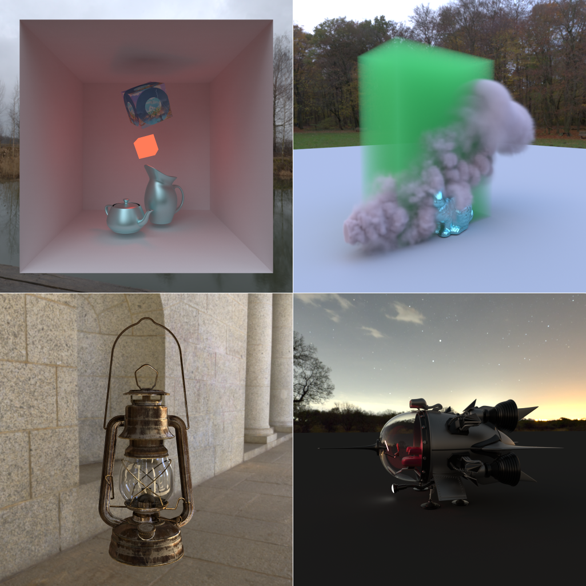

# Btrc

GPU path tracer using two-stage programming

Work in progress...

## TODO

- [ ] volume primitive
- [ ] filter importance sampling
- [ ] separable bssrdf
- [ ] disney bsdf
- [ ] separate rng dimensions & low-discrepancy samplers
- [ ] radiance cache
- [ ] lightweight photon mapping
- [ ] light bvh
- [ ] path guiding

## Gallery

